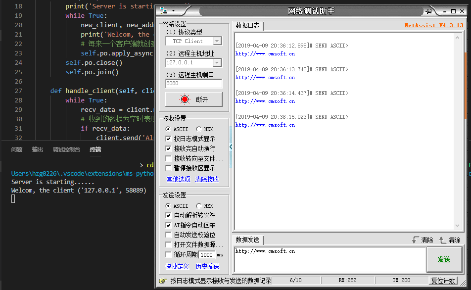

# web-server
综合使用Python中的多任务、网络编程、HTTP协议等知识点，模拟实现WSGI协议的服务器框架，达到类似Flask的功能。

# 各种服务器模型
在实际中，服务器为了能同时处理多个客户端请求，应该要实现多任务机制。对应的，在Python中就可以实现多进程服务器、多线程服务器、多协程服务器、非阻塞模式服务器、事件响应机制的服务器等多种服务器模型。

## 多进程之Process类
利用Python中的`multiprocessing`模块中的`Process`类，可以实现多进程服务器。代码实现见`apps/process.py`。
* 服务器的监听套接字每接收到一个新的客户端到来，就创建一个进程管理之。
* 注意，由于子进程中的资源是直接复制父进程中的，故在创建完`Process`类的子进程后，应当关闭掉父进程中的客户端套接字。

## 多进程之Pool类
利用Python中的`multiprocessing`模块中的`Pool`类，也可以实现多进程服务器，它也是多进程的一种机制。代码实现见`apps/pool.py`。
* 在实际实现的过程中，起初想使用类去实现**进程池**的多任务。但是在调试过程中发现，这样**并没有达到多任务**的目的，**原因暂时不清楚，后续填坑**。
* 不在类中实现进程池，而是在单纯的函数中以同样的代码实现进程池，可以达到多任务的目的。

## 多线程
利用Python中的`threading`模块中`Thread`类，可以是实现多线程服务器。代码实现见`apps/thread.py`。
* 代码基本同使用`Pool`类实现多任务。只不过由于**多线程共用全局变量**，故不能在主线程中关闭客户端套接字。

## 多协程
利用Python中第三方库的`gevent`模块中`spawn, joinall`等函数，可以是实现多协程服务器。代码实现见`apps/coroutine.py`。
* 协程时基于线程中的一种机制，它的切换就像函数一样。效率是最高的一种多任务方式。
* 某个协程会在执行完100条字节码或者阻塞时会自动切换到另一个协程。所以如果主协程没有发生任何阻塞时协程不会起作用，这是需要人为阻塞`g.join()`。
* 普通的阻塞时没有作用的，必须是`gevent`模块中封装的阻塞函数才能切换协程。所以需要重构代码，但是这很麻烦，所以需要打`monkey`补丁。
* 打`monkey`补丁需要在要打补丁的库导入之前，所以一般`monkey`补丁放在文件的最开头。

## 非阻塞
将服务器和客户端套接字利用`s.setblocking(False)`将其设置成非阻塞模式，这样所有的阻塞函数都会立即返回数据，如果没有数据则返回异常。通过`try`的异常捕获机制+轮询的方式可以高效地处理多个客户端套接字。代码实现见`apps/unblock.py`。
* 由于套接字为非阻塞模式，故需要捕获异常。若发生异常则说明没有数据到来，若没有发生异常则有数据到来。
* 非阻塞模式实现了单线程高并发，是一种高效的服务器模式。

## epoll
epoll服务器的机制类似于非阻塞，但是却不是非阻塞。因为epoll采用的并不是轮询的笨方式，而是采用**os级别的监听，利用事件通知的机制**来达到单线程的多并发。代码实现见`apps/epoll.py`。
* epoll服务器利用os层来监听事件，当对应事件发生时，通知绑定了该事件的fd。
* epoll是最高效的服务器方式。

# WSGI
WSGI是一套服务器协议，它沟通服务器软件和框架，使得二者可以很好的解耦。在WSGI中有一些成文的要求：
* 在WSGI中实现`set_header(status, headers)`函数，它用来封装响应头。
* 在框架中实现`application(env, start_reponse)`，其中`env`为请求头字典，`start_response`即WSGI中的`set_header`。该函数返回响应体。
* 在WSGI中调用`application`，输入`请求头字典env`和`set_header`，输出`响应体body`。